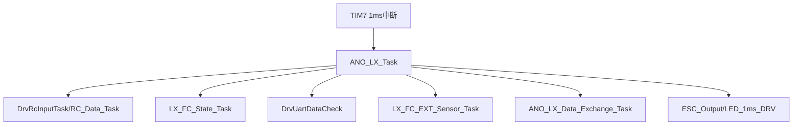
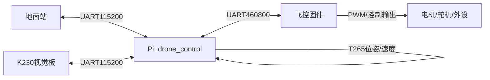

# 01 总体架构

## 1.1 仓库分层概览

本仓库是“飞控固件 + 树莓派/地面端控制”的组合形态：

- **飞控固件（C，裸机）**：负责实时控制（RC输入、状态机、安全、传感器融合入口、通信、PWM输出）。
- **树莓派控制端（Python）**：负责高层任务（航点、覆盖规划、视觉联动）、与飞控/地面站/视觉板通信、T265定位与速度输出。

两者通过串口协议互通，形成“高层规划在Pi，实时闭环在飞控”的系统。

## 1.2 飞控固件架构（两工程通用）

### 1.2.1 目录分层（从业务到硬件）

- **应用/业务层：`FcSrc/`**
  - 调度、主任务、状态机、外部传感器适配、通信协议（匿名数传协议）等。
- **板级组合层：`DriversBsp/`**
  - `All_Init()` 负责把底层驱动组装成整机初始化序列（UART/RC/ADC/PWM/定时器/光流/GPS等）。
- **MCU/库层：`DriversMcu/`**
  - 按 MCU 平台拆分（STM32F407 / MSP432 / TM4C123），包含外设驱动与第三方库（CMSIS/StdPeriph/TI driverlib/USB栈等）。
- **工程层：`Project*/*.uvprojx`**
  - Keil uVision 工程文件，分别对应不同 MCU 目标板。

### 1.2.2 启动与运行模型

固件入口统一为 `main()`：

- [main.c](file:///workspace/ANO_LX_FC_T265代替光流/FcSrc/main.c#L22-L37)
  - `All_Init()`：初始化硬件与软件模块
  - `Scheduler_Setup()`：初始化“时分调度器”
  - `while(1) Scheduler_Run()`：主循环驱动任务表

在 **STM32F407** 目标上，还存在“1ms 定时中断驱动主任务”的旁路（优先级通常更高、时基更稳定）：

- `TIM7_IRQHandler -> ANO_LX_Task()`：[stm32f4xx_it.c](file:///workspace/ANO_LX_FC_T265代替光流/DriversMcu/STM32F407/Drivers/stm32f4xx_it.c#L59-L69)

可将其理解为：

- **主循环调度器**：偏“低实时性/后台任务”（按任务表周期执行）
- **TIM7 1ms 中断任务**：偏“强实时性链路”（RC→状态→通信→输出）

### 1.2.3 1ms 主任务骨架（T265版示例）

`ANO_LX_Task()` 是飞控“输入→处理→输出”的集中点（T265版更完整）：

- [ANO_LX_Task](file:///workspace/ANO_LX_FC_T265代替光流/FcSrc/ANO_LX.c#L289-L341)
  - 10ms：RC采样与模式切换、用户RC处理、飞控状态机、光流状态检测
  - 100ms：电池电压采样
  - 每1ms：串口收包解析、GPS处理、外部传感器处理、匿名协议数据交换、对外发送（T265/拓展板/OpenMV）、电机输出、LED驱动

## 1.3 两套固件工程的差异点

两套工程目录结构一致，但业务与外设配置不同：

### 1.3.1 T265代替光流版

- 增加用户模块：`User_T265/User_Ctrl/User_ComBoard/User_Opmv/User_Oled/User_Gpio` 等（均在 [FcSrc](file:///workspace/ANO_LX_FC_T265代替光流/FcSrc)）。
- `All_Init()` 中串口角色更明确：UART1 用于 T265，UART3 用于串口拓展板等：[Drv_BSP.c](file:///workspace/ANO_LX_FC_T265代替光流/DriversBsp/Drv_BSP.c#L61-L89)
- 任务调度中包含“多控制模式叠加”（位置环/绕杆/巡线/现场编程等），见 [Ano_Scheduler.c](file:///workspace/ANO_LX_FC_T265代替光流/FcSrc/Ano_Scheduler.c#L38-L195)
- `note.txt` 标注主要标志位在 `User_Ctrl/User_ComBoard/User_Task`：[note.txt](file:///workspace/ANO_LX_FC_T265代替光流/Doc/note.txt#L20-L25)

### 1.3.2 倾角保护版

- 额外目录 `Mycode/`，包含倾角补偿与自定义协议等：
  - [my_protocol.c](file:///workspace/ANO_LX_FC_倾角保护版/Mycode/my_protocol.c)
  - [angle_protect.c](file:///workspace/ANO_LX_FC_倾角保护版/Mycode/angle_protect.c)
- 调度器中存在“灵活帧发送”用于观测/转发（例如 `flex_send_t265_vel()`）：[Ano_Scheduler.c](file:///workspace/ANO_LX_FC_倾角保护版/FcSrc/Ano_Scheduler.c#L43-L51)

## 1.4 树莓派控制端（Python）架构

Python 侧以 [drone_control](file:///workspace/drone_control) 为根：

- **串口通信层**：[Lprotocol.py](file:///workspace/drone_control/Lcode/Lprotocol.py)
  - `Serial_fc`：与飞控通信（速度帧 0x01 + 指令帧 0x02 + 回传帧）
  - `Serial_dmz`：与地面站通信（禁飞区上行 + 检测结果下行）
- **定位层**：[t265.py](file:///workspace/drone_control/t265.py)
  - 优先使用 `pyrealsense2`；缺失时进入“模拟模式”
- **任务编排/状态机**：[Mission_GPT.py](file:///workspace/drone_control/Mission_GPT.py)
  - 起飞→导航→检测→降落的状态机；支持“地面站禁飞区→覆盖规划→生成航点”
- **进程入口**：[main.py](file:///workspace/drone_control/main.py)
  - 初始化串口与T265，创建 `mission`，循环触发 `mission.start()`

