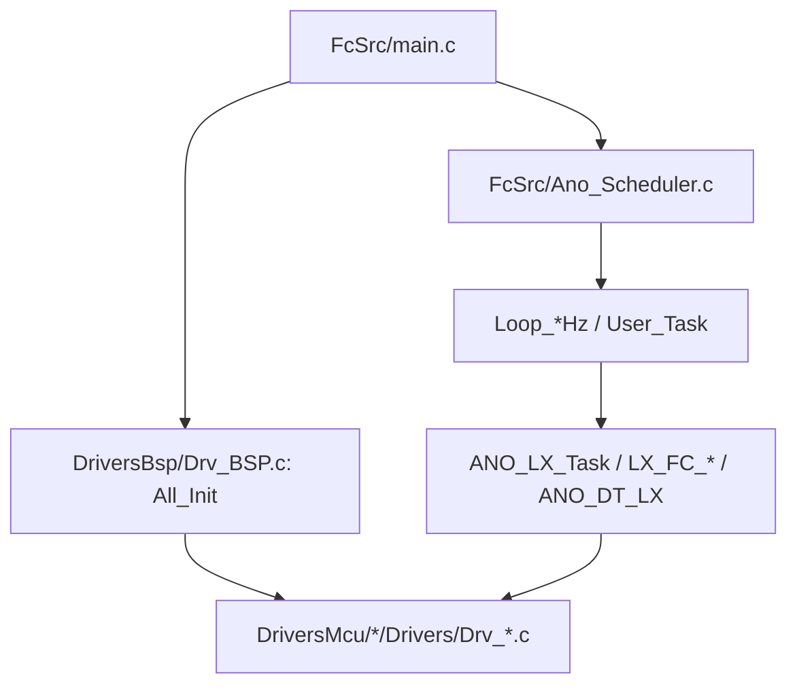
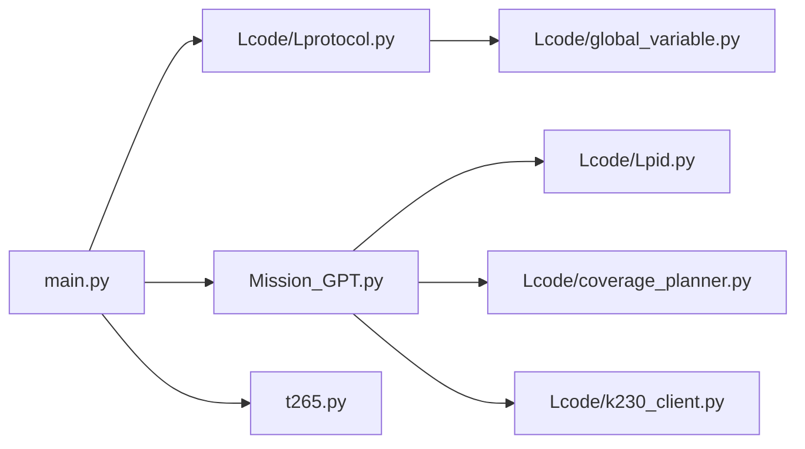

# 04 依赖关系

## 4.1 外部依赖（固件侧）

固件侧不使用包管理器，依赖以“源码/库目录 + IDE工程配置”形式存在，主要包括：

- **Keil uVision / ARMCC 5.06**（工程文件显示使用 ARM-ADS 工具链）
  - STM32F407 工程：[ANO_LX_STM32F407.uvprojx](file:///workspace/飞控固件/ProjectSTM32F407/ANO_LX_STM32F407.uvprojx#L10-L15)
  - MSP432 工程：[ANO_LX_MSP432.uvprojx](file:///workspace/飞控固件/ProjectMSP432/ANO_LX_MSP432.uvprojx#L10-L15)
- **STM32F4 CMSIS / StdPeriph**
  - 位于 [DriversMcu/STM32F407/Libraries](file:///workspace/飞控固件/DriversMcu/STM32F407/Libraries)
- **USB Stack（STM32F407）**
  - 位于 [DriversMcu/STM32F407/Libraries/USBStack](file:///workspace/飞控固件/DriversMcu/STM32F407/Libraries/USBStack)
- **CMSIS DSP / arm_math**
  - STM32F407 目录中包含 DSP_Lib 源码：见 [DriversMcu/STM32F407/Libraries/CMSIS/DSP_Lib](file:///workspace/飞控固件/DriversMcu/STM32F407/Libraries/CMSIS/DSP_Lib)
- **TI driverlib（MSP432/TM4C）**
  - MSP432 driverlib（含多编译器 Makefile）：[driverlib/gcc/Makefile](file:///workspace/飞控固件/DriversMcu/MSP432P401/Drivers/ti/devices/msp432p4xx/driverlib/gcc/Makefile#L28-L47)

## 4.2 外部依赖（Python侧）

[drone_control](file:///workspace/drone_control) 目录未提供 `requirements.txt/pyproject.toml`，从源码导入可推断主要依赖为：

- `pyserial`（`import serial`）：[Lprotocol.py](file:///workspace/drone_control/Lcode/Lprotocol.py#L1)
- `numpy`（`import numpy as np`）：[t265.py](file:///workspace/drone_control/t265.py#L1-L4)
- `pyrealsense2`（可选；缺失则自动模拟）：[t265.py](file:///workspace/drone_control/t265.py#L7-L13)
- `transformations`（可选；缺失则使用简化变换）：[t265.py](file:///workspace/drone_control/t265.py#L14-L19)

K230 视觉板脚本（[animal_detect_yolov8n.py](file:///workspace/drone_control/animal_detect_yolov8n.py)）运行在 CanMV/K230 环境，依赖其内置 `libs.* / nncase_runtime / ulab.numpy` 等，不属于 Python venv 依赖范围。

## 4.3 内部模块依赖（固件侧）

### 4.3.1 分层依赖（推荐理解方式）

- `FcSrc/*` 依赖 `SysConfig.h`，进一步依赖 `McuConfig.h`（平台差异）与 `Drv_BSP.h`（板级能力聚合）
  - 例如：[SysConfig.h](file:///workspace/飞控固件/FcSrc/SysConfig.h#L1-L5)
- `Drv_BSP.c` 通过调用 `DriversMcu/*/Drivers/Drv_*.c` 暴露的统一接口完成初始化
  - 例如：`DrvUart*Init/DrvTimerFcInit/DrvPwmOutInit` 等：[Drv_BSP.c](file:///workspace/飞控固件/DriversBsp/Drv_BSP.c#L21-L89)

### 4.3.2 STM32F407：中断到业务的依赖链

- `TIM7_IRQHandler` 直接调用 `ANO_LX_Task()`：[stm32f4xx_it.c](file:///workspace/飞控固件/DriversMcu/STM32F407/Drivers/stm32f4xx_it.c#L59-L69)
- `ANO_LX_Task()` 串联：
  - RC输入：`DrvRcInputTask`（BSP）
  - 状态机：`LX_FC_State_Task`（FcSrc）
  - 通信：`ANO_LX_Data_Exchange_Task`（FcSrc）
  - 输出：`DrvMotorPWMSet`（MCU驱动）
  - 见：[ANO_LX_Task](file:///workspace/飞控固件/FcSrc/ANO_LX.c#L289-L341)

## 4.4 内部模块依赖（Python侧）

Python 侧依赖关系可概括为：

- `main.py` 依赖 `Lcode.Lprotocol`（串口）、`t265_class`（定位）、`mission`（任务）
  - [main.py](file:///workspace/drone_control/main.py#L1-L39)
- `mission` 依赖 `CoveragePlanner`（覆盖规划）、`PID`（速度控制）、`K230Client`（视觉板）、并通过共享缓冲区写入 `se_fc/se_dmz` 触发串口线程发送
  - [Mission_GPT.py](file:///workspace/drone_control/Mission_GPT.py#L4-L9)

