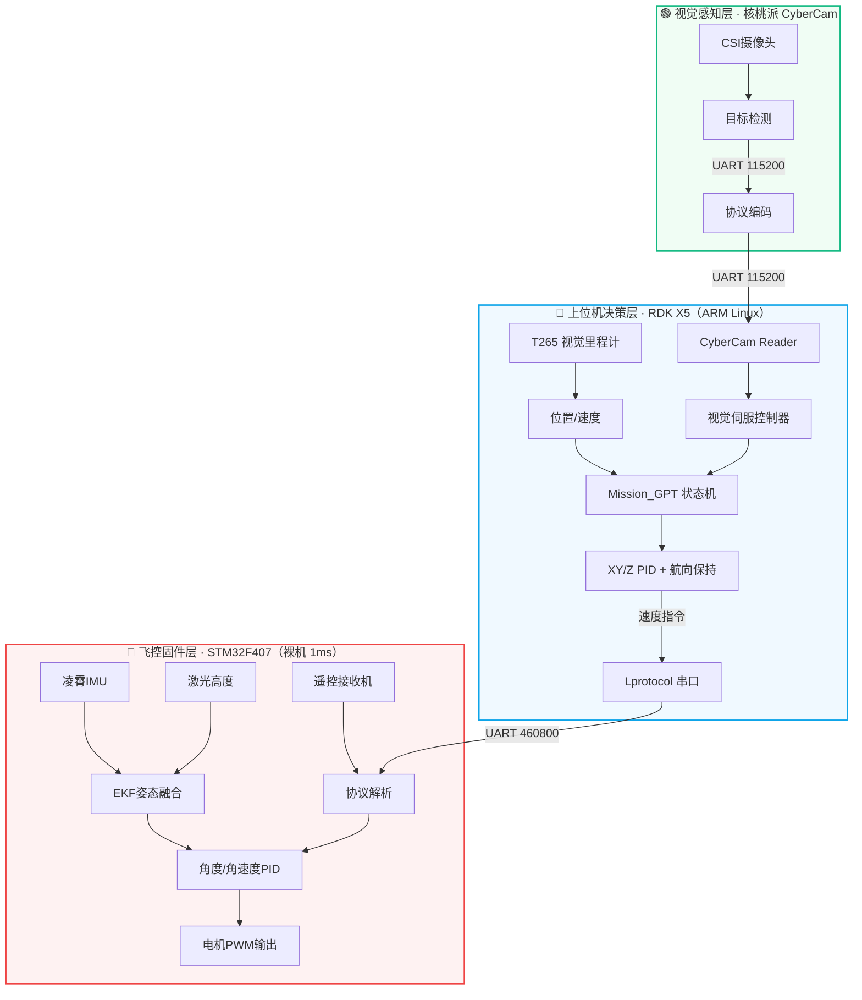

# 三层架构详解

## :memo: 本节介绍

本节详解飞控固件、Python上位机、视觉感知三层系统的职责边界、数据流和关键参数。

## :trophy: 学习目标

1. 画出三层架构的数据流图，知道数据从哪来到哪去
2. 知道每层用什么技术、跑在什么硬件上、什么频率
3. 理解「裸机飞控 + 上位机智能决策」的分层思路
4. 知道视觉板是可选的，基础飞行不需要它

---

## 架构总览



## 第一层：飞控固件（C / 裸机）

<div class="arch-layer arch-layer-firmware">
  <div class="arch-layer-title">🔴 飞控固件层</div>
  <div class="arch-layer-desc">1ms 定时中断驱动，负责姿态解算、PID 控制、电机输出、传感器融合。不跑操作系统，极致实时性。</div>
  <div class="arch-modules">
    <span class="arch-module">主调度器 Scheduler</span>
    <span class="arch-module">ANO_LX 1ms任务</span>
    <span class="arch-module">凌霄IMU EKF融合</span>
    <span class="arch-module">电机PWM输出</span>
    <span class="arch-module">遥控/串口解析</span>
    <span class="arch-module">一键任务状态机</span>
    <span class="arch-module">T265数据接收</span>
  </div>
</div>

| 项目 | 说明 |
|------|------|
| MCU | STM32F407（主用），支持 MSP432 / TM4C123 |
| IDE | Keil uVision |
| IMU | 凌霄IMU（内置EKF，4个融合参数） |
| 实时性 | 1ms 定时中断驱动（TIM7），硬实时 |
| 核心文件 | `FcSrc/ANO_LX.c`（1ms主任务）、`User_Ctrl.c`（控制律）、`User_Task.c`（一键任务） |

!!! danger "编码禁令"
    飞控固件 `.c/.h` 文件使用 **GB2312/GBK 编码**，绝对禁止用普通编辑器（VS Code、Notepad 等）直接打开修改。

    - **人工修改**：用 Keil uVision 打开工程编辑
    - **AI Agent 修改**：用 `edit_firmware.py` 脚本

    详见 [固件编辑规范](../09-workflow/firmware-edit.md)。

## 第二层：上位机决策（Python 3）

<div class="arch-layer arch-layer-python">
  <div class="arch-layer-title">🔵 上位机决策层</div>
  <div class="arch-layer-desc">运行在地瓜派 RDK X5（ARM Linux）上，30ms 控制周期，负责任务状态机、视觉导航、PID位置控制、日志记录。</div>
  <div class="arch-modules">
    <span class="arch-module">Mission_GPT 状态机</span>
    <span class="arch-module">Lprotocol 串口协议</span>
    <span class="arch-module">Lpid 位置PID</span>
    <span class="arch-module">HeadingHold 航向保持</span>
    <span class="arch-module">t265 视觉里程计</span>
    <span class="arch-module">navigation_profile 航点策略</span>
  </div>
</div>

| 项目 | 说明 |
|------|------|
| 硬件 | 地瓜派 RDK X5（ARM Linux，用户 `sunrise`） |
| 控制周期 | 30ms |
| 核心文件 | `Mission_GPT.py`（状态机）、`Lprotocol.py`（串口）、`Lpid.py`（PID）、`t265.py`（T265接口） |
| 通信 | 串口 `/dev/ttyS6`，460800 baud，匿名AA帧协议 |

三线程串口架构：

```
Lprotocol.py 内部：
├── 监听线程    飞控→Pi   50Hz（姿态/激光高度/解锁状态）
├── T265发送    Pi→飞控   100Hz（速度）
└── 指令发送    Pi→飞控   50Hz（速度指令）
```

## 第三层：视觉感知（核桃派）

<div class="arch-layer arch-layer-vision">
  <div class="arch-layer-title">🟢 视觉感知层</div>
  <div class="arch-layer-desc">独立视觉板，运行目标检测算法（黑色方块/AprilTag/蓝色方块），通过 UART 115200 将检测结果发送给上位机，用于视觉伺服精准降落。搭载 CentOS Linux，支持 SSH 直连，方便远程开发和调试。</div>
  <div class="arch-modules">
    <span class="arch-module">detector 目标检测</span>
    <span class="arch-module">protocol 串口协议</span>
    <span class="arch-module">calib 相机标定</span>
    <span class="arch-module">servo_controller IBVS</span>
  </div>
</div>

!!! info "可选层"
    视觉板是进阶功能，基础飞行不需要。新手可以先忽略这一层，专注飞控+上位机两层。

---

## :material-help: 常见问题

??? question "为什么不用 RTOS（如 FreeRTOS）做飞控？"
    裸机 1ms 中断驱动的实时性比 RTOS 更可控，没有任务调度抖动。对于竞赛场景，功能简单（姿态+电机+串口），不需要 RTOS 的多任务管理开销。

??? question "上位机和飞控的串口波特率为什么用 460800？"
    T265 速度数据需要 100Hz 发送，每帧约 20 字节，460800 baud 足够。太低会丢帧，太高在长线上会出错。经过大量实测这是最稳定的值。

??? question "视觉板和上位机之间为什么要用 UART 不用 USB？"
    USB 在飞行振动环境下可能松动，UART 排线更可靠。且 UART 是全双工、低延迟，适合实时控制。视觉检测结果数据量小（每帧几十字节），UART 115200 完全够用。

??? question "为什么选 CyberCamera（核桃派）而不是 K230 或直接用摄像头？"
    视觉处理开发板有很多选择（K230、直接 USB 摄像头等），选 CyberCamera 的核心原因是它搭载 CentOS Linux 系统，支持 SSH 直连。这意味着可以像操作普通 Linux 服务器一样远程修改代码、调试检测算法，不需要拔板子接显示器。对于竞赛开发迭代来说，这个便利性是决定性因素。

---

← [项目是什么](what-is-this.md) | [硬件清单 →](hardware.md)
