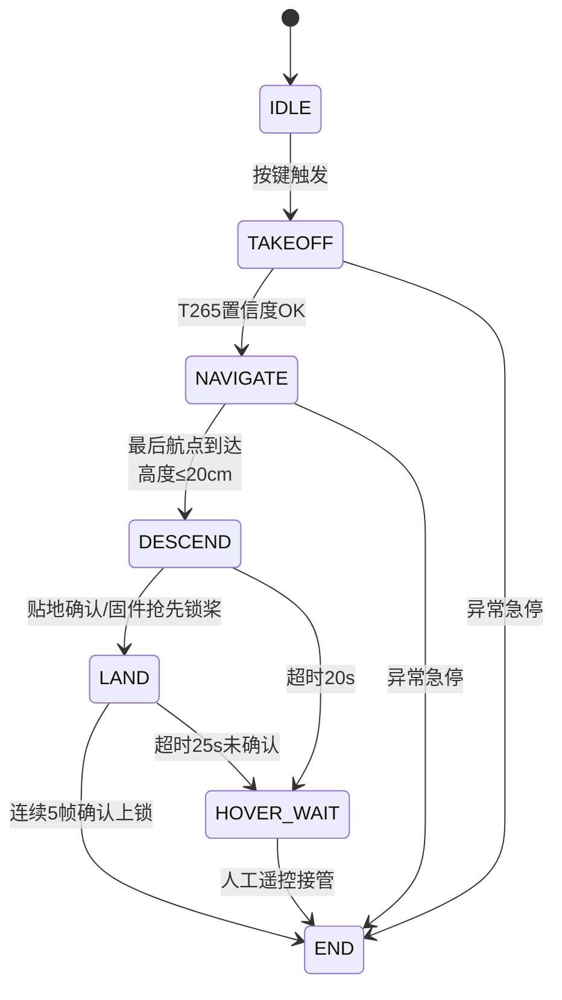

# 桌面模拟飞行

不需要任何硬件，就可以在本地电脑上看到完整的状态机运行流程。T265 和飞控都会自动使用模拟数据。

## 运行

```bash
cd drone_control/basic

# Linux/macOS
DRONE_DRY_RUN=1 python main.py

# Windows PowerShell
$env:DRONE_DRY_RUN=1; python main.py
```

## 预期输出

```
[INFO] Logger initialized
[INFO] DRY_RUN mode enabled - hardware will be simulated
[INFO] GPIO Button initialized (dry-run: virtual button)
[INFO] RGB LED initialized (dry-run: console output)
[INFO] Waiting for takeoff button press...
[INFO] Button pressed! Starting takeoff sequence...
[WARN] RED LED - 5 seconds warning, CLEAR THE AREA!
[INFO] T265 initialized (simulated)
[INFO] Serial port opened (simulated)
[INFO] State: IDLE -> TAKEOFF
[INFO] Lifting off to 35cm...
[INFO] T265 confidence OK, starting PID climb to target altitude
[INFO] Heading hold activated, initial yaw locked
[INFO] State: TAKEOFF -> NAVIGATE
[INFO] Navigating to waypoint 1: (0.0, 0.0, 1.0)
[INFO] Waypoint 1 reached, holding 1.5s
[INFO] Navigating to waypoint 2: (-0.6, 0.0, 1.0)
...
[INFO] State: NAVIGATE -> DESCEND
[INFO] Descending to landing height...
[INFO] State: DESCEND -> LAND
[INFO] Motors locked (simulated)
[INFO] State: LAND -> END
[INFO] Flight complete! Flight log saved.
```

!!! success "恭喜！"
    如果看到状态机完整跑完 IDLE → TAKEOFF → NAVIGATE → DESCEND → LAND → END，说明你的环境完全正常，可以进入真机飞行环节了。

## 状态机流程图



---

[运行单元测试 →](run-tests.md)
