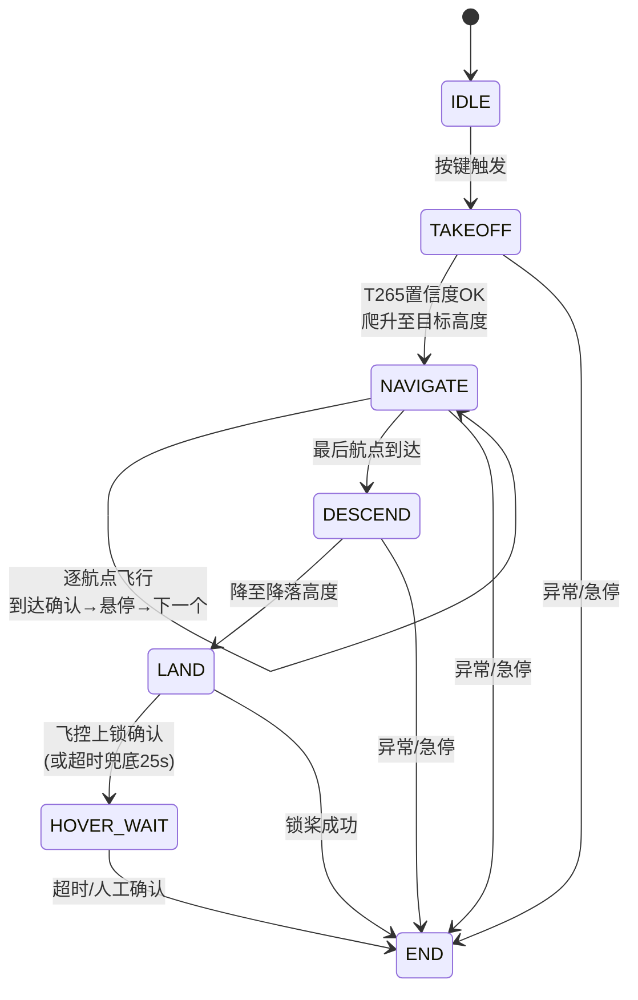

# 状态机流程

所有飞行任务由 `Mission_GPT.py` 中的有限状态机驱动。

## 状态流转

## 各状态详解

### IDLE — 等待
- 等待 `start()` 调用（按键触发）
- 同时完成 T265 初始化和串口连接

### TAKEOFF — 盲飞离地
- 盲飞离地至 35cm（不依赖T265）
- 等待 T265 置信度 ≥ 2，超时 8s
- 激活航向保持，开始 PID 爬升至目标高度

### NAVIGATE — 逐航点飞行
- 每个航点：PID控制 → 滑动窗口到达确认 → 悬停1.5s → 下一个
- 两种到达策略：`precision`（精确） / `cruise`（巡航）
- 首尾航点自动降级为 `precision` 保证精度

### DESCEND — 缓降
- 水平开环控制
- ramp 方式降高至降落高度

### LAND — 等待锁桨
- 等待飞控上锁（连续5帧 `unlock_sta==0`）
- 超时兜底 25s

### HOVER_WAIT — 人工确认
- 等待人工目视确认电机完全停转
- 超时后自动退出

## 安全保护机制

| 机制 | 触发条件 | 动作 |
|------|---------|------|
| 飞控帧超时 | 2s 无飞控帧 | 急停 |
| T265 位姿丢失 | 置信度异常 | 急停 |
| 激光高度异常 | 高度>10m（错误码） | 滤除 |
| 航向保持跑飞 | yaw误差>15° | 触发保护 |
| 近地强制锁定 | 固件层保护 | 锁桨 |

---

[目录结构 →](directory-tree.md)
